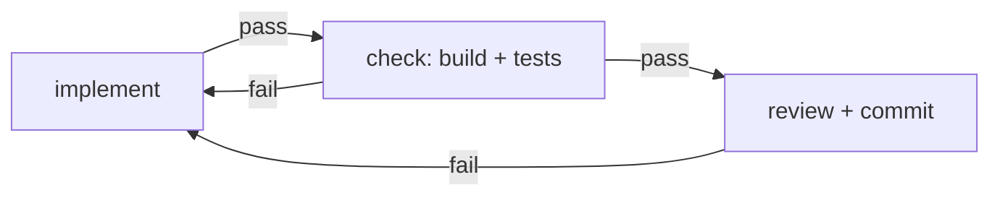
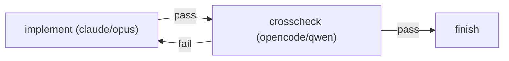
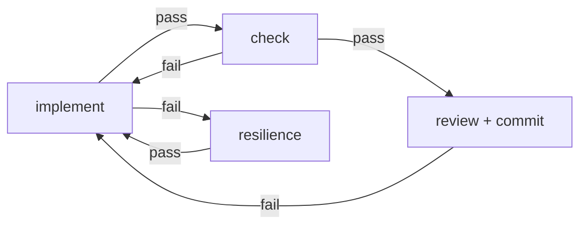
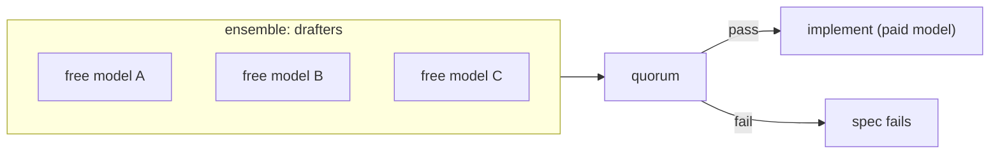
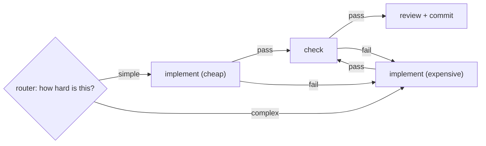
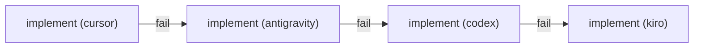
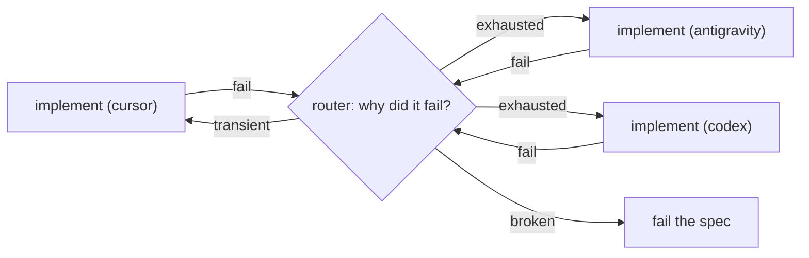
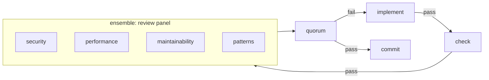
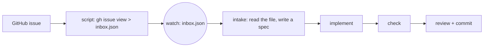
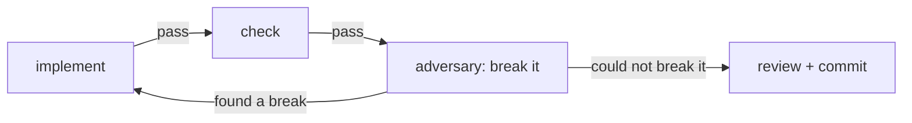

# Usage Patterns

A graph is a shape you choose before you write a single prompt. The shape
decides what happens when something goes wrong — which is the only part of
the design that matters, because the happy path is the same in every graph
ever built: an agent does the work and it was fine.

Everything below is a shape. The prompts are implementation detail; you can
swap models, harnesses and wording freely inside a shape without changing
what the graph *is*. Getting the shape wrong is expensive in a way that
getting a prompt wrong is not.

## How to read this page

Patterns carry a status, because a shape that has drained a real backlog and
a shape that exists only in a diagram deserve different levels of trust:

| Status | Meaning |
|---|---|
| **Proven** | Has run real specs to completion on this machine. |
| **Designed** | The engine supports it today; we have not run it. |
| **Blocked** | Needs something the engine does not have yet, named below. |

---

## 1. Gated implement — Proven

The workhorse. An agent writes code, a deterministic check verifies it, a
reviewer judges whether the spec was honored, and only then does anything
land.

Three rules make this work, and each was learned by watching it not work:

**The implement edge is `pass`, never `always`.** An `always` edge routes a
*failed* implement into the reviewer, which then approves work that was never
written. A real run marked a spec `completed` with no commit behind it that
way.

**The check sits before the reviewer.** Code that does not build never
reaches review. Otherwise the reviewer writes `CHANGES_NEEDED: implementation
is broken` and the spec is marked `completed` anyway, because routing keys on
the run's status, not on its prose.

**Auto-fixing commands must not bounce work.** Run `cargo fmt --all`, which
rewrites, not `cargo fmt --check`, which fails. Only genuine breakage should
route back to implement.

Use it for: essentially everything. Start here and add shape only when a
specific failure justifies it.

---

## 2. Cross-platform check — Proven

The same shape, with the reviewer deliberately on a different vendor from the
implementer.

A model reviewing its own family's output shares its blind spots, and shares
its quota ceiling. Splitting the two across vendors buys independent judgment
and means one exhausted subscription does not stall the whole graph.

Keep the cross-check prompt narrow — diff plus spec plus "find what is
wrong". A cross-checker invited to re-implement will re-implement.

Use it for: security-sensitive changes, and anywhere you suspect the fix is
overfit to one model's reading of the spec.

---

## 3. Resilience branch — Proven

Pattern 1 fails the spec the moment implement dies, so nobody ever reads the
failure. If the CLI died on a quota that resets at a known hour, that
knowledge is thrown away. Give implement two exits.

The resilience node is a cheap model on a *different quota* from the
implementer — otherwise it is dead exactly when you need it. It reads the
dead node's output and either repairs a transient failure and reports pass
(so implement retries), or recognizes exhaustion, calls
`graph_schedule_autorun` with the reset time, and reports fail — the spec
fails, but the graph wakes itself at that instant.

Give it the clock. Models do not know what time it is, and "resets 6am" is
ambiguous without it: a real run at 01:52 scheduled the wake-up for 6am *the
next day*, a 23-hour stall. The prompt must require `date -Iseconds` first.

Use it for: any unattended graph that runs longer than your shortest quota
window.

---

## 4. Draft ensemble — Proven

An ensemble is 2–8 agent nodes that get the same prompt in parallel, plus a
quorum that waits for all of them. The canonical use spends the expensive
model once, on a pre-digested problem.

The ensemble is **one unit**, not three hand-wired nodes:
`graph_add_ensemble` creates the members, the quorum, and the entry and exit
edges in a single call. Wiring three parallel `pass` edges out of one node by
hand is the "ambiguous outgoing edges" mistake, and it aborts the run.

Three free models propose an approach; the quorum consolidates their
proposals into one document; the expensive implementer receives all three and
writes the code. You paid for one expensive run instead of one expensive
exploration plus one expensive implementation.

The mirror image also works: 2–3 free reviewers read the same diff and the
quorum consolidates their findings into one verdict.

Use it for: problems where the *approach* is the hard part and the typing is
not.

---

## 5. Router by complexity — Proven

The first shape that needs the router node. Two implementers on different
harnesses and price points; a cheap classifier reads the spec and decides
which one earns it.

Two things about this diagram are load-bearing and easy to get wrong.

**A failed cheap implement escalates to the expensive one — it does not go
back to the router.** The router would classify the same spec the same way
and send it back to the model that just failed, forever. Routing decisions
based on the spec are stable by definition; only new information should
produce a new decision.

**The check's fail edge also goes to the expensive implementer**, for the
same reason: by the time a build is red, the cheap classification has been
falsified by evidence.

**The router must be cheap.** A router as expensive as the expensive
implementer means you paid the high price on every task, including the ones
you routed away from it.

---

## 6. Free-tier cascade — Designed

You have four CLIs with generous free tiers and small ceilings. Spend all of
them in sequence before touching anything you pay for.

The naive version is a chain of fail edges, and it is a trap:

**`fail` conflates "my quota is gone" with "this code is wrong".** A spec
with a genuine bug in it burns all four free tiers on the same wrong task,
and you end the day with every ceiling spent and nothing done. The chain only
makes sense if it routes on *why* the node failed.

Which is a router — one node for the whole cascade instead of a triage node
between every pair:

Two more things worth knowing before you build this.

**Exhaustion does not look the same on every harness.** Some CLIs exit
non-zero with a message naming the reset time; others simply stop responding
and die on the node's timeout. A model reading the output generalizes across
both; a regex matching one vendor's wording does not, and there is no version
of that regex that survives a CLI update.

**The engine has no memory of a spent harness.** If spec 1 burns cursor and
antigravity, spec 2 starts at cursor again and spends an iteration
rediscovering that it is dead — and it does that for every remaining spec in
the queue. Today the only lever is `graph_schedule_autorun`, which parks the
*whole graph* until a reset. A per-harness "unavailable until" that the
router could read does not exist yet.

---

## 7. Specialist review panel — Designed

An ensemble where each member reviews a different axis: one reads for
security, one for performance, one for maintainability, one for the
project's own patterns.

Per-member prompt overrides are available — each member can carry its own
`prompt_override` in `graph_add_ensemble`, so a specialist panel runs all
four axes in parallel with one call instead of four sequential nodes.

**`min_pass` means the wrong thing here.** With homogeneous members,
`min_pass: 2 of 3` reads as "a majority agrees" and that is sensible. With
specialists, each member owns a *different* axis, so `min_pass: 3 of 4` reads
as "one whole dimension of quality may fail and we ship anyway". You want all
four to pass.

But `min_pass = all` with four cheap models means the grumpiest one blocks
every change forever. The honest requirement is not a vote count at all —
it is **severity**: block on a real finding, record a nitpick. The quorum
counts votes and cannot express that.

The workable version today: `min_pass = all`, and push the severity
discipline into each member's prompt — *"fail only on a defect in your axis
that would matter in production; everything else goes in your report, not
your verdict."* That raises the floor without pretending the engine
understands severity.

---

## 8. Event intake — Proven in shape

A graph does not have to be started by you. It can fire on a cron slot or a
filesystem watch, which makes it the back half of an event pipeline whose
front half is anything that can write a file.

The front half does not need a public endpoint. A real webhook does — a
tunnel, a forwarding service, something listening — and for work that can
wait five minutes, one cron line calling `gh issue list --search` and writing
a file is strictly simpler and stays local-first. Use a real webhook only
when the latency actually matters.

The intake node is a normal agent node whose job is to turn the file into a
spec via `spec_create` and `queue_add_spec`. Once it does, the rest of the
graph is pattern 1 and knows nothing about GitHub.

**The gap**: a watch-triggered graph is told *that* it fired, never *what*
fired it. The watcher logs the changed path and then calls the engine with
only the graph id (`src/watchers/mod.rs:98`). If your script writes to one
well-known path, the intake node can just read that path and the gap costs
you nothing — which is why this is a solved pattern today. It bites the
moment you watch a *directory* and need to know which file arrived.

---

## 9. Adversarial pair — Designed

A reviewer asks "is this right?". An adversary asks "how do I break this?".
Those are different jobs and they produce different findings.

Note the inverted edges: the adversary reports **fail** when it *succeeds* at
breaking the change. Its prompt should demand a concrete reproduction — an
input, a sequence, a race — not an opinion. An adversary that cannot produce
one has not found anything, and saying so must be a legitimate, unpunished
outcome, or it will invent findings to look useful.

Pairs naturally with pattern 8: an issue that arrives from outside is exactly
the case where you want something actively trying to falsify the fix before
it lands.

---

## Choosing a shape

| If the thing you fear is… | Use |
|---|---|
| Broken code landing | 1 — gated implement |
| One vendor's blind spot | 2 — cross-platform check |
| A quota ending overnight | 3 — resilience branch |
| Spending the good model on exploration | 4 — draft ensemble |
| Spending the good model on trivia | 5 — router by complexity |
| Paying at all before the free tiers are gone | 6 — free-tier cascade |
| A whole dimension going unreviewed | 7 — specialist panel |
| Work arriving while you sleep | 8 — event intake |
| A fix that is right but fragile | 9 — adversarial pair |

Shapes compose. The graph that drains this project's own backlog is 1 + 3,
and grows a 5 with the router.

---

## What the engine does not have yet

Collected from the patterns above, because a limitation stated once in
context is worth more than a roadmap:

- **Memory of a spent harness.** Nothing survives a spec boundary to say
  "cursor is exhausted until 4pm", so a cascade rediscovers it every time.
- **Severity in a quorum.** Members vote pass/fail; there is no way to say
  "this finding blocks, that one is a note".
- **The triggering event's payload.** A watch-fired graph gets the fact, not
  the path.

See [Recipes](recipes.md) for these shapes built end to end, with the actual
calls and prompts.
